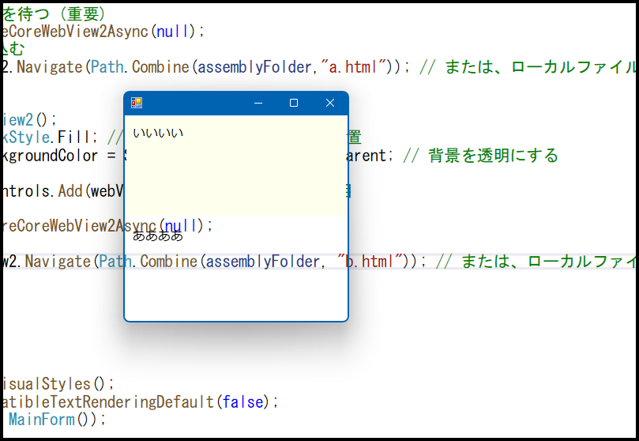

- 以下の画像は、１つのウィンドウに２つのWebView2インスタンスを配置している。

- ウィンドウを背景をピンクに設定し、ピンクを透明色にすることで、フォームの背景は透過となる。

- WebView2の背景に透過を設定する。  (WebView2インスタンス自体の DefaultBackgroundColor にTransParentを設定)
  これは「**ユーザープロファイル**」とは「**無関係**」なので、「PreferredColorScheme」とは異なり、  
  「他への干渉がなく、安全」と思われる。

- 下図は、WebView2コンポーネントの背景が透けてる様子  
  
  
  
  
